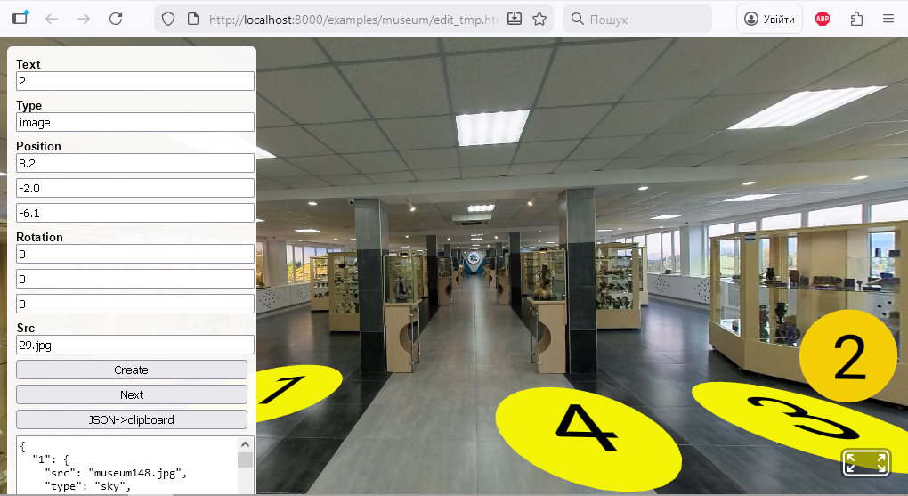
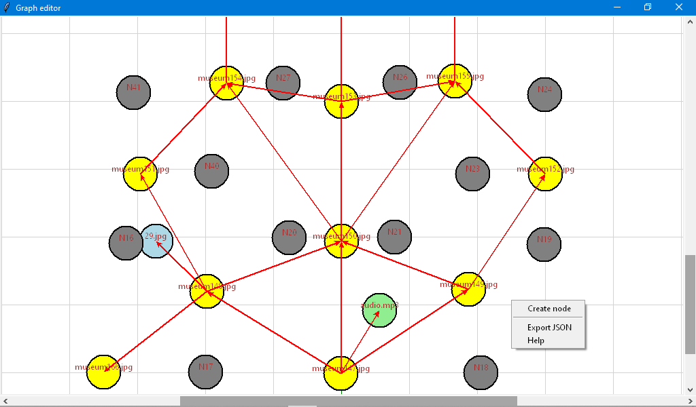
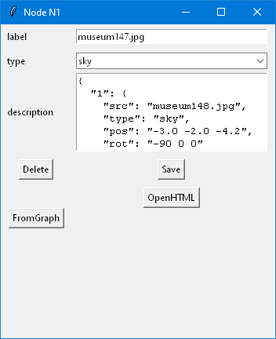

# A-FrameTours
Simple framework for creating virtual tours based on A-Frame

The programs are designed to create, edit and play virtual tours based on spherical photos and videos, 3D models and other resources. Using A-Frame allows you to view tours from the browser of any computer or smartphone, including using virtual reality helmets. The virtual tour editor represents tours as directed graphs, which makes it easy to create complex tours with many scenes.

## Example
https://vkopey.github.io/A-FrameTours/

## Install (Windows)
1. Download and unpack https://github.com/aframevr/aframe/tree/gh-pages (button Code)
2. Download this repo (button Code). Unpack files in geditor to aframe-gh-pages. Other files unpack to some dir in examples.
3. In index.html you can replace src="https://aframe.io/releases/1.7.1/aframe.min.js" to src="../../../dist/aframe-master.min.js"
4. Download and unpzip
https://sourceforge.net/projects/portable-python/files/Portable%20Python%203.10/Portable%20Python-3.10.5%20x64.exe/download
5. Edit path to python.exe in geditor.bat and run.bat
6. Run geditor.bat for edit
7. Run run.bat for local serve
8. After run.bat in browser goto http://localhost:8000/examples/museum for view or to http://localhost:8000/examples/museum/edit.html for edit without geditor.py

## Creating a virtual tour
To create a virtual tour, you need to prepare the following materials: spherical photos (jpg), regular photos (jpg), audio files (mp3), 3D models (glb), spherical videos (mp4). These files must be in the same directory as the index.html file.
The structure of the virtual tour is defined by the data.json file, which must be in the same directory as the index.html file. Example of a data.json file:
```json
{
  "museum147.jpg": {
    "1": {
      "src": "museum148.jpg",
      "type": "sky",
      "pos": "-3.0 -2.0 -4.2",
      "rot": "-90 0 0"
    },
   "2": {
      "src": "29.jpg",
      "type": "image",
      "pos": "-3.2 -2.0 -3.2",
      "rot": "0 45 0"
    },
    "3": {
      "src": "museum149.jpg",
      "type": "sky",
      "pos": "4.3 -2.0 -3.7",
      "rot": "-90 0 0"
    },
    "4": {
      "src": "audio.mp3",
      "type": "sound",
      "pos": "1.4 -2.0 -3.4",
      "rot": "-90 0 0"
    }
  }
}
```
Here "museum147.jpg" is the filename of the spherical photo of the scene, and "1", "2", "3", "4" are the circular labels on the scene that respond to user clicks. For an example, see the image below.



Each label has the following attributes: "src" – file name, "type" – resource type, "pos" – label coordinates, "rot" – label rotation angles. Resource types: "image" – regular photo, "sky" – spherical photo, "sound" – audio , "vsky" – spherical video , "gltf" – 3D model.
To create simple virtual tours, you can prepare the data.json file in a regular text editor with syntax highlighting (e.g. notepad++). However, for complex tours, it is advisable to use tools such as:
1. aframe-inspector.min.js – visual inspector for any A-Frame scenes (https://github.com/aframevr/aframe-inspector)
2. edit.html – a single scene editor in the browser. Before running it, you need to replace the string "museum147.jpg". The image above shows edit.html in action. On the left are the attributes of the current label (Text, Type, Position, Rotation, Src) and buttons Create – create a label, Next – select the next one, JSON->clipboard – copy the scene JSON to the clipboard. The last button also transfers the scene JSON to the geditor_aframe.py server in the "description" field, if it is enabled (read below). The coordinates of the current label are changed with the arrow keys, PageUP, PageDown, and the rotation angles are set with the W, A, S, D, Q, R keys.
3. geditor_aframe.py is a graph-based tour editor and edit.html. It is recommended for complex virtual tours with many scenes. All scenes and labels are nodes of a directed graph, and the graph's edges indicate the belonging of labels to scenes:



Nodes are created using Create node. Double-clicking on a node opens a window for editing it:



Here "label" is the name of the resource file, "type" is the type of resource, "description" is the description of the labels on the scene (nodes that the arrows point to). Delete button is used to delete a node, FromGraph – get the approximate value of the "pos" attribute all labels from the graph, Save – save attributes in RAM, OpenHTML – open this scene in the browser using edit.html. It is recommended to first click FromGraph, then open the scene OpenHTML to more accurately set the values of coordinates and rotation angles in edit.html, pass the data to the "description" field (JSON->clipboard), and then click Save. Do not click again after that FromGraph+Save . After you finish editing all scenes, click Export JSON to save the graph file, for example museum.json. The program will automatically create a ready-made data.json file.

## Other
https://aframe.io/

https://en.wikipedia.org/wiki/Virtual_tour

Відео українською: https://youtu.be/Nw4M382wbKs

Відео роботи з редактором сцен (edit.html): https://youtu.be/gLqk75ysRwI

Відео роботи з редактором графів (geditor_aframe.py): https://youtu.be/APRVzDU7ls4
